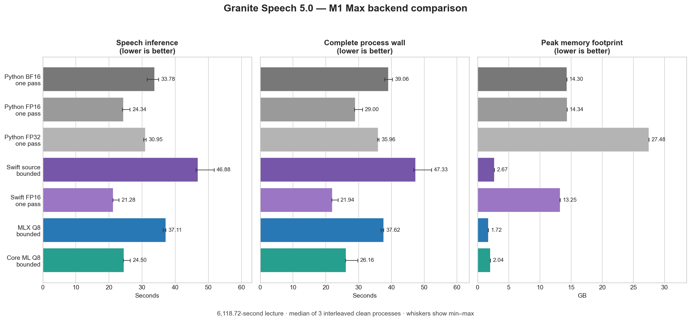

# Core ML backend experiments

These experiments converted Granite Speech 5.0 TurboCTC into a fixed-shape
Core ML ML Program and searched compute-unit placement, graph output,
quantization, and long-audio chunk sizing on an M1 Max Mac. The result is a
native Swift Core ML backend that can beat this project's release MLX backend.
The selected package is published with its tokenizer, configuration, source
provenance, checksums, and model card at
[`iky1e/granite-speech-5.0-470m-turboctc-coreml-q8`](https://huggingface.co/iky1e/granite-speech-5.0-470m-turboctc-coreml-q8).

## Result

The best configuration is uniform Q8 palettization with one scale/palette per
output channel (`group_size=1`), a macOS 15 deployment target, CPU+GPU compute,
and a 16,384-frame input. The graph represents 327.68 seconds of audio; the CLI
keeps 20.48 seconds of context on each side and advances by 286.72 seconds.

| Backend | Speech inference, median (min–max) | Process wall | Peak footprint | Agreement with native Swift source |
|---|---:|---:|---:|---:|
| IBM source BF16 / Python MPS, one pass | 33.78 s (31.50–34.99) | 39.06 s | 14.30 GB | 97.5835% |
| IBM source cast to FP16 / Python MPS, one pass | 24.34 s (24.01–26.30) | 29.00 s | 14.34 GB | 97.5468% |
| IBM source promoted to FP32 / Python MPS, one pass | 30.95 s (30.42–31.18) | 35.96 s | 27.48 GB | 97.5395% |
| IBM source / native Swift MLX, bounded | 46.88 s (46.29–51.73) | 47.33 s | 2.67 GB | 100.0000% |
| Converted FP16 / native Swift MLX, one pass | **21.28 s (21.16–22.99)** | **21.94 s** | 13.25 GB | 99.7650% |
| MLX release Q8, 122.88/20.48 bounded | 37.11 s (36.35–37.17) | 37.62 s | **1.72 GB** | 99.8825% |
| **Core ML Q8/G1, 16,384, bounded** | **24.50 s (24.32–26.38)** | **26.16 s** | 2.04 GB | **99.7797%** |

These are medians of three complete, interleaved rounds. Core ML was 34.0%
faster for speech inference and 30.5% faster process-to-process than bounded
MLX Q8 while increasing measured peak footprint by about 318 MB. Its raw
transcript had 0.265% word disagreement with bounded MLX and 99.838% character
similarity. These are reference-output diagnostics, not WER against a human
transcript.

The MLX row records the 122.88/20.48-second profile used in this quiet backend
matrix. The CLI now defaults to 122.88/10.24 seconds. In a later paired test
under much heavier background load, the new MLX profile reduced median
inference from 25.281 to 21.952 seconds and peak footprint from 1.652 to 1.627
GB. Its absolute timing is not mixed into this table. It retained 99.7797%
agreement with matching Q8 FP16 one-pass output, with no missing or duplicated
passages in manual review.

The Python rows are fresh three-run medians through
`AutoModelForCTC.generate()` using Transformers 5.16.1 and PyTorch 2.13.0 on
MPS. The checkpoint is stored as BF16. “FP16” casts those BF16 values to FP16
at runtime; “FP32” promotes the same values and cannot restore information that
was not present in the checkpoint.

FP16 remained the fastest valid Python path at 24.34 seconds median speech
time and a 14.34 GB peak physical footprint. It emitted 13,595 words, differed
from promoted FP32 by one word (99.9926% agreement), and was deterministic
across all three rounds. Native BF16 took 33.78 seconds at 14.30 GB and retained
99.9117% agreement with promoted FP32. The native-Swift comparison additionally
includes MPS versus MLX numerical behavior and one-pass versus bounded
long-form decoding; it is not model accuracy or human-reference WER.

The current documented input preparation pre-casts the full feature tensor
before `generate()`. For this recording that tensor is `[1, 305936, 320]`. On
PyTorch 2.13 MPS, releasing its 391.6 MB FP32 source before inference silently
corrupted both BF16 and FP16 long-form results. Either retaining that source or
leaving features FP32 until Granite's first layer performs its mandatory cast
produced complete, deterministic output. This matches the known class of
allocator-state-dependent MPS wrong-result defects in
[`pytorch/pytorch#193487`](https://github.com/pytorch/pytorch/issues/193487)
and the related greater-than-65,536-row biased-linear defect in
[`pytorch/pytorch#189495`](https://github.com/pytorch/pytorch/issues/189495).
Complete valid and failure-mode runs, memory counters, environment metadata,
and transcripts are in `python-source-results.json` and the adjacent TXT files.

A same-session comparison also ran converted Swift MLX FP16 and Python MPS
FP16 with chunking disabled. Swift's new three-run median was 21.28 seconds
versus Python's 24.34 seconds, making Swift 12.5% faster. The result confirms
that repeated bounded chunks, rather than Swift language overhead, explain the
earlier apparent gap. Swift's 13.25 GB peak remains unsuitable as the
production default.

With the user-facing Q8 punctuation model enabled, Core ML took 24.60 seconds
for speech and 1.10 seconds for formatting. Processing finished in 25.78
seconds and process wall time was 26.59 seconds. The formatted transcript had
99.7140% lexical word agreement with the formatted MLX result. Punctuation and
case make strict formatted word edits look larger (2.1822%) even when lexical
content is unchanged.

All nine configurations produced byte-identical transcripts across rounds.
Speech-time coefficient of variation ranged from 1.23% to 6.18%; the first
round was usually slower and rounds two and three converged. Full per-run
timings, memory counters, machine-load snapshots, comparisons, and transcripts
are in [`../backend-matrix`](../backend-matrix).



## Why the Neural Engine did not win

The Core ML compute plan prefers the Neural Engine for 722 operations, but 32
dynamic attention matmuls are unsupported: query-key and attention-value
matmuls in every Conformer layer. Core ML therefore partitions the graph
between CPU and ANE. On this M1 Max, CPU+ANE took about 103 ms for the short
fixed graph versus 53 ms for CPU+GPU. `computeUnits=all` behaved similarly.

This does not prove that every newer Apple chip behaves identically. It does
show that simply selecting the ANE is not an optimization for this architecture
on M1; the unsupported dynamic attention operations and transfer/partition
cost dominate any ANE gains.

## Quantization findings

- Core ML linear INT8 weight quantization was approximately 14x slower than
  FP16 on the 8,192-frame graph despite preserving the short transcript.
- Per-tensor Q8/Q6/Q4 palettes were fast but destroyed recognition accuracy.
- Grouped-channel Q8 palettes were fast. Group 32 reduced package size to 487
  MiB but caused 0.977% word disagreement on the lecture. Group 1 retained the
  best accuracy at 660 MiB and is the recommended choice.
- Q6/G1 is 406 MiB but caused 0.507% disagreement, a 4.74 GB measured peak, and
  lazy-compilation latency. It is not a better release default.
- Q4/G1 retained the short transcript despite 1.56% frame-ID disagreement, but
  was not promoted to a full-audio candidate.
- Core ML supports 1/2/3/4/6/8-bit palettes, not 5-bit palettes.
- INT8 activation calibration completed with a coarse calibration group but
  the resulting graph crashed in Core ML. Core ML Tools 9 offered no usable
  FP8 activation conversion for this graph.

The 16,384-frame graph is the speed/memory sweet spot measured here. 32,768
frames was slightly slower at 18.32 seconds and used 2.88 GB; 24,576 frames was
both slower and thermally inconsistent. The CLI now automatically fills the
selected Core ML graph after reserving its context, so users do not need the
benchmark's explicit chunk-size arguments.

## Reproduce

Install the locked Python environment, convert FP16, then palettize it:

```bash
uv sync
uv run python Scripts/convert_granite_coreml.py \
  /path/to/granite-speech-5.0-470m-turboctc \
  /path/to/granite-coreml-fp16-16384.mlpackage \
  --feature-frames 16384 --minimum-target macos15

uv run python Scripts/quantize_granite_coreml.py \
  /path/to/granite-coreml-fp16-16384.mlpackage \
  /path/to/granite-coreml-q8-g1-16384.mlpackage \
  --method palette-uniform --bits 8 \
  --granularity per-channel --block-size 1
```

Build and run the native backend. The published package is downloaded and
cached automatically:

```bash
swift build -c release
Scripts/build_mlx_metallib.sh release

.build/release/granite-mlx lecture.wav \
  --backend coreml \
  --output-format txt --benchmark
```

For a local conversion, additionally pass
`--coreml-model /path/to/model.mlpackage --model /path/to/tokenizer`.

The first load downloads the repository and compiles the package into an
OS-specific `.mlmodelc`
under `~/Library/Caches/GraniteMLX/CoreML`. Later runs reuse it. Core ML can
still perform lazy device preparation on model load, so model-load timing is
reported separately from speech inference.

`results.json` contains every number summarized above. Generate the checked
PNG with `uv run python Scripts/chart_coreml.py`.
