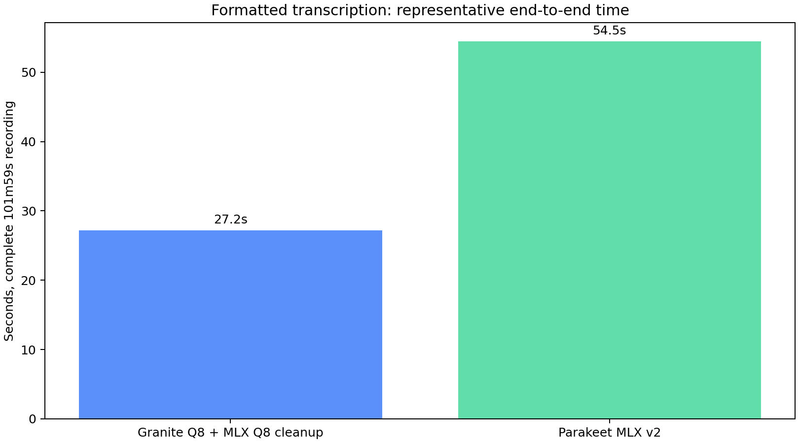

# Formatted Granite and Parakeet comparison

This benchmark compares the complete user-facing pipelines on the same
6,118.72-second Stanford CME295 lecture:

- Granite Q8 speech recognition followed by the Q8 MLX punctuation formatter.
- Parakeet TDT 0.6B v2 through `parakeet-mlx`, which emits formatted text.

Representative uncontended wall times were 27.16 seconds for Granite plus its
formatter (225.3x real time) and 54.46 seconds for Parakeet (112.4x real time)
on the benchmark M1 Max. Granite was therefore about 2.0x faster for these
complete formatted-output runs.

The transcript-to-transcript scores in `results.json` are diagnostics rather
than accuracy measurements: neither model output is human ground truth, and
the recognizers differ lexically as well as in punctuation choices. The JSON
also retains the slower contention-affected runs rather than silently
discarding them.

- [`results.json`](results.json) is the machine-readable source of truth.
- `granite/` contains Granite's raw and formatted text plus timing records.
- `parakeet/` contains Parakeet's formatted text and process timing.
- `formatted-speed-comparison.png` is generated from the representative times.

