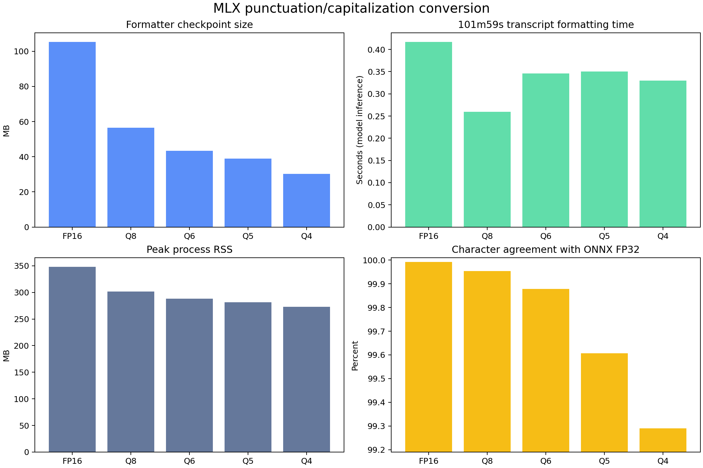

# Punctuation model conversion benchmark

This directory validates the MLX conversion of
[`1-800-BAD-CODE/punctuation_fullstop_truecase_english`](https://huggingface.co/1-800-BAD-CODE/punctuation_fullstop_truecase_english)
on Granite's raw transcript of the 6,118.72-second Stanford CME295 lecture.
The original ONNX FP32 output is the reference. These comparisons measure
conversion similarity, not punctuation quality against a human-edited
transcript.

| Variant | Weight file | Character agreement with ONNX FP32 | Total formatter time |
|---|---:|---:|---:|
| FP16 | 100.4 MiB | 99.9916% | 0.492 s |
| **Q8 (CLI default)** | **53.8 MiB** | **99.9536%** | **0.330 s** |
| Q6 | 41.4 MiB | 99.8777% | 0.411 s |
| Q5 | 37.2 MiB | 99.6066% | 0.425 s |
| Q4 | 28.9 MiB | 99.2899% | 0.393 s |

Q8 offers the best measured balance for the user-facing default. The five MLX
checkpoints are available in the
[Punctuation & Capitalization Model MLX collection](https://huggingface.co/collections/iky1e/granite-speech-50-punctuation-and-capitalization-model-mlx-6a8f6ad45d0f10d3f0bbc5b2).

- `onnx-fp32.json` records the baseline.
- `mlx-*.json` records size, timing, memory, and edit-distance results.
- `*.txt` preserves every compared transcript.
- `repositories.json` maps variants to their Hugging Face repositories.
- `mlx-quantization-results.png` visualizes the comparison.

