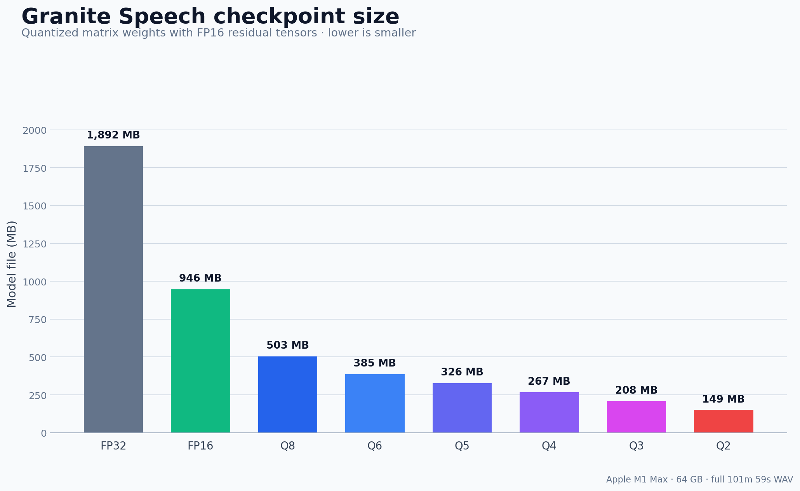
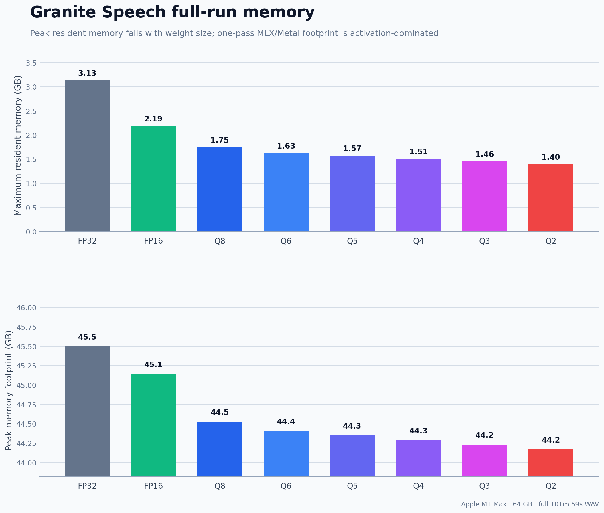
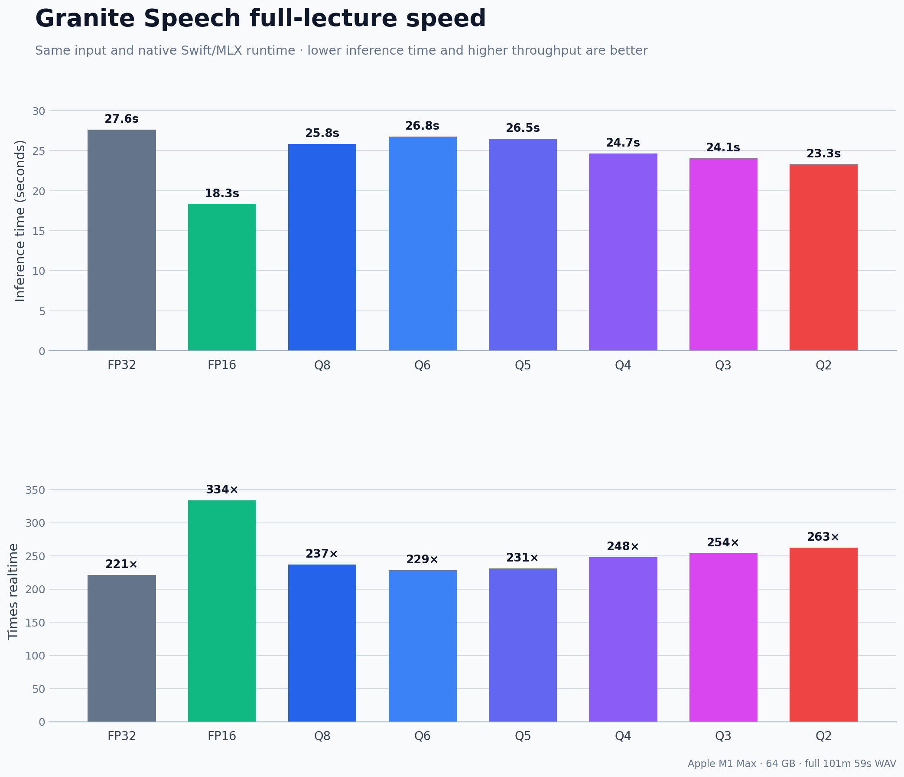
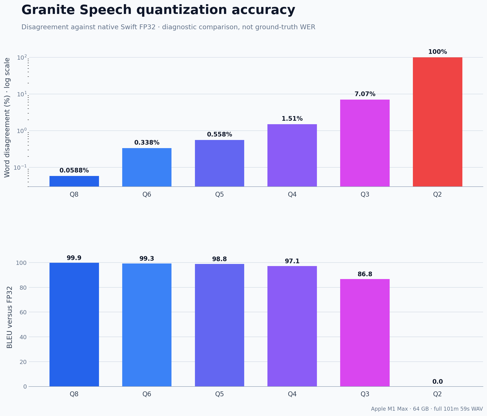

# Granite-MLX quantization benchmark

Measured on 26 August 2026 using an Apple M1 Max with 64 GB RAM. Every runtime
used the same native Swift/MLX release binary and the same 16 kHz mono WAV. The
full recording is 6,118.72 seconds (101m 58.72s).

Quantized checkpoints use affine weight-only quantization with group size 64.
All 179 two-dimensional Linear/Embedding weights are quantized. Convolution,
normalization, and bias tensors remain FP16. Activations remain floating point.

| Format | File (MB) | Full inference (s) | Realtime | Max RSS (GB) | Word edits vs Swift FP32 | Disagreement |
| --- | ---: | ---: | ---: | ---: | ---: | ---: |
| FP32 | 1,892.0 | 27.641 | 221.4x | 3.135 | 0 | 0% |
| FP16 | 946.0 | 18.337 | 333.7x | 2.193 | 0 | 0% |
| Q8 | 503.4 | 25.816 | 237.0x | 1.751 | 8 | 0.059% |
| Q6 | 385.4 | 26.756 | 228.7x | 1.632 | 46 | 0.338% |
| Q5 | 326.3 | 26.490 | 231.0x | 1.575 | 76 | 0.558% |
| Q4 | 267.3 | 24.656 | 248.2x | 1.514 | 205 | 1.506% |
| Q3 | 208.3 | 24.059 | 254.3x | 1.458 | 962 | 7.066% |
| Q2 | 149.3 | 23.302 | 262.6x | 1.397 | 13,615 | 100% |

Word disagreement is an edit-distance diagnostic against the native Swift FP32
transcript, not ground-truth WER. The JSON also includes BLEU, chrF2, character
similarity, comparisons with the Python/PyTorch FP32 transcript, every short
run, every full run, model load time, process wall time, and both macOS memory
measurements.

- [`results.json`](results.json) is the programmatic source of truth.
- [`transcripts`](transcripts) contains every measured short and full output.
- [`charts`](charts) contains PNG charts generated directly from the JSON.

